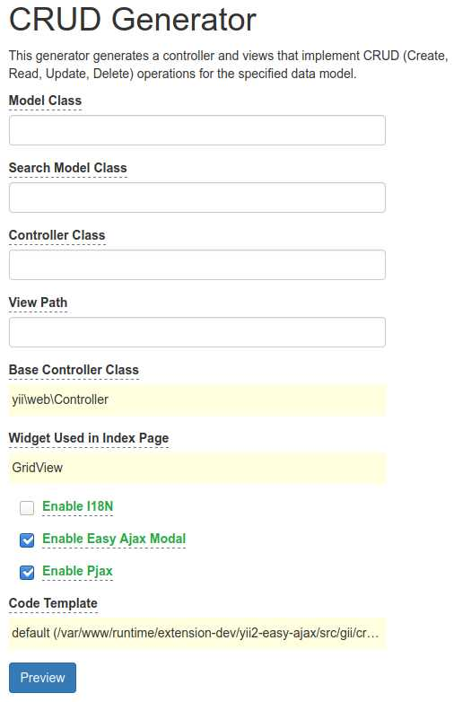

# yii2-easy-ajax

Relax your keyboard with Yii2 EasyAjax

EasyAjax are a bunch of Yii methods that minimize the amount of code you need to write to interact with Bootstap UI and with Javascript in general.

[Notifies](#notify), [modals](#modals), [tabs](#ajax-tabs), [pjax-reloads](#pjax-reload), [form validations](#form-validation) among others can now be set up and launched with only a line of code into the controller's action response.  

For example,  `EasyAjax::modal('My modal content')` opens a modal with "My modal content" as _content_, while `EasyAjax::reloadPjax(['#p0'])` reloads the `pjax-container` identified by `id="p0"`

EasyAjax further provides:

- Complete and ready-to-use **ajax CRUD**, thanks to the integrated [Gii generator](#Ajax-CRUD-with-Gii)
- Fully configurable options both globally and action-specific
- Customizable HTML templates
- Extensible with your own methods

## Installation
The preferred way to install this extension is through [composer](http://getcomposer.org/download/).

Either run


```composer require --prefer-dist letsjump/yii2-easy-ajax```


or add


```"letsjump/yii2-easy-ajax": "~1.0.0"```

to the `require` section of your composer.json.

## Configuration

To use this extension, add the following code to your web application configuration (config/web.php):

```php
'components' => [
    'easyAjax' => [
        'class' => 'letsjump\easyAjax\EasyAjaxBase',
        'customOptions' => [
            /* refer to plugin documentation */
        ]
    ],
]
```

To use the integrated [Gii generator](#Ajax-CRUD-with-Gii), add the following code to your application configuration:

```php
if (YII_ENV_DEV) {
    $config['bootstrap'][] = 'gii';
    $config['modules']['gii'] = [
        'class' => \yii\gii\Module::class,
        // uncomment the following to add your IP if you are not connecting from localhost.
        'allowedIPs' => ['127.0.0.1', '::1', /** your IPs */],
        'generators' => [
            'crud' => [ 
                'class'     => 'letsjump\easyAjax\gii\crud\Generator',
                'templates' => [ //setting for out templates
                    'yii2-easy-ajax' => '@vendor/letsjump/yii2-easy-ajax/gii/crud/default',
                ]
            ],
        ],
    ];
}
```

Please note: The integrated [Gii generator](#Ajax-CRUD-with-Gii) allows you to generate the code for AJAX as well as the standard CRUD.

## Usage

- [1. Requests](#1.-Requests)
- [2. Responses](2.-Responses)

### 1. Requests

EasyAjax requests are simple jQuery AJAX requests that need to refer to a controller action appropriately configured:

The easiest way to perform an EasyAjax request to a controller action is adding the `data-yea=1` attribute to the Html tag in charge of the _onclick javascript event_:

```html
<a data-yea="1" class="btn btn-lg btn-success" href="<?= \yii\helpers\Url::to(['controller/action-notify']) ?>">notify something</a>
```

or

```html
<button data-yea="1" data-form-id="friend-form" type="submit" class="btn btn-primary pull-right">Save</button>
```

> NOTE:
> 
> To explore any other Html attributes available and to know all the details, please refer to the [guide](docs/guide/requests.md)

### 2. Responses

The controller actions interacting with EasyAjax should return a _Json array_, and they only need to contain one or more EasyAjax methods in their response array. 

In the following example...

```php
public function actionSaveMyModel()
{
    Yii::$app->response->format = \yii\web\Response::FORMAT_JSON;

    // your model validation and save logic...

    return [
        \letsjump\easyAjax\EasyAjax::modalClose(),
        \letsjump\easyAjax\EasyAjax::reloadPjax(['#p0']),
        \letsjump\easyAjax\EasyAjax::notifySuccess('Your model has been saved')
    ];
}
```
... EasyAjax will:
- Closes the [bootstrap modal](https://getbootstrap.com/docs/3.4/javascript/#modals) opened in the UI
- [Reload](https://github.com/yiisoft/jquery-pjax#fnpjax) the pjax-container `#p0`
- Shows a [Bootstrap Notify](http://bootstrap-notify.remabledesigns.com/) informing the user of the successful operation

Here are the available methods in detail:

#### Modals

With EasyAjax, you can fire and configure a [Bootstrap Modal](https://getbootstrap.com/docs/3.4/javascript/#modals) using the following: <code>EasyAjax::modal(content, title, _form_id, size, footer, options_)</code>

```php
public function actionModal()
{
    Yii::$app->response->format = \yii\web\Response::FORMAT_JSON;
    
    return [
        \letsjump\easyAjax\EasyAjax::modal('This is the modal content', 'Modal title'),
    ];
}
```

It is also available a method to remotely close a Modal which is actually open in the UI:

```php
public function actionCloseModal()
{
    Yii::$app->response->format = \yii\web\Response::FORMAT_JSON;
    
    return [
        \letsjump\easyAjax\EasyAjax::modalClose(),
    ];
}

```

 > You can edit the modal layout and many other settings. Please refer to the [guide](docs/guide/modals.md) for all the available options.

---

#### Notify

**EasyAjax Notify** allows to control the [Bootstrap Notify plugin](http://bootstrap-notify.remabledesigns.com/). The plugin assets (`bootstrap-notify.js` and `animate.js`) are bundled within EasyAjax. 

> Tip: You can disable the asset inclusion if it is already bundled in your application

To fire a Notify, you can use <code>\letsjump\easyAjax\EasyAjax::notify(message, *title*, *settings*)</code>.
In the `settings` parameter, you should specify the type of notification displayed (`Notify::TYPE_INFO` (blue), `Notify::TYPE_SUCCESS` (green), `Notify::TYPE_WARNING` (yellow) or `Notify::TYPE_DANGER` (red)).

To speed up your coding, I have also added some shortcut methods for the most common notification types: `EasyAjax::notifyInfo(message)`, `EasyAjax::notifySuccess(message)`, `EasyAjax::notifyWarning(message)`, `EasyAjax::notifyDanger(message)`.

Example:

```php
public function actionNotify()
{
    Yii::$app->response->format = \yii\web\Response::FORMAT_JSON;
    return [
        \letsjump\easyAjax\EasyAjax::notifyInfo('This is an Info Notify!')
    ];
}
```

> Note: Actually notify doesn't refer to the [Yii2 flash message session array](https://www.yiiframework.com/doc/api/2.0/yii-web-session#$flash-detail). Please open an issue if you think it is needed.
>
> Refer to the [guide](docs/guide/notify.md) for all the available options and template manipulation.

---
#### Pjax Reload

The EasyAjax PjaxReload (`EasyAjax::pjaxReload(['#myPjaxID0', '#myPjaxID1', ...])`) method allows to reload one or more Pjax containers.

```php
public function actionPjaxReload()
{
    Yii::$app->response->format = \yii\web\Response::FORMAT_JSON;
    
    return [
        \letsjump\easyAjax\EasyAjax::reloadPjax(['#p0'])
    ];
}
```

> Refer to the [guide](docs/guide/pjax-reload.md) for detailed informations.

---
#### Form Validation

The form validation (`EasyAjax::formValidation(['#my-form-id'=>ActiveForm::validate(MyModelClass)])`) method allows to display the validation results for the specified form. It will send the validation results for each form field specified by the `#form-id` attribute to [display its error messages](https://github.com/samdark/yii2-cookbook/blob/master/book/forms-activeform-js.md).

```php
public function actionValidateForm()
{
    Yii::$app->response->format = \yii\web\Response::FORMAT_JSON;
    $contactForm                = new ContactForm();
    
    return [
        \letsjump\easyAjax\EasyAjax::formValidation(['#contact-form' => \yii\widgets\ActiveForm::validate($contactForm)])
    ];
}
``` 
> Refer to the [guide](docs/guide/form-validation.md) for detailed informations.

---
#### Ajax CRUD with Gii

The bundled Gii generator within EasyAjax allows you to instantly create the Ajax CRUD controller and views. 



This will generate a CRUD schema which is identical to the Yii2 original one, with an added `actionModal($id=null)` into the controller code, plus its relative <code>_myViewFolder_/_modal.php</code> view in charge of creating or updating the data in an Ajax modal.

You can switch the CRUD behavior to Ajax modal by simply setting the 'modal' parameter of the integrated ActionColumn method : 

```php
// myViewFolder/index.php 

<?= \yii\grid\GridView::widget([
    'dataProvider' => $dataProvider,
    'filterModel' => $searchModel,
    'columns' => [
        ['class' => 'yii\grid\SerialColumn'],
        'id',
        // ... your gridview fields
        [
            'class' => 'letsjump\easyAjax\helpers\ActionColumn',
            'modal' => true
        ],
    ],
]); ?>
```

> BONUS: Deleting a record doesn't imply a complete page refresh, therefore the GridView pagination will not be affected.
> 
> Refer to the [guide](docs/guide/gii.md) for all the available options.

---

#### Ajax Tabs

EasyAjax Tab (`EasyAjax::tab('tab-id', 'content to inject')`) is a simple and _very basic_ way to update the content of a [Bootstrap Tab](https://getbootstrap.com/docs/3.4/javascript/#tabs) with an ajax response from a controller.

**View**

In the \yii\bootstrap\Tabs widget for each _tab item_, you must:
- Include a `linkOptions` parameter with a reference to the controller action Url and a `data-yea=1` parameter which will fire the request. 
- Set the tab container ID (`'options'     => ['id' => 'yourTabID']`) for a stable reference to its content.

```php
<?= \yii\bootstrap\Tabs::widget([
    'items' => [
        [
            'label'       => 'Rome',
            'linkOptions' => [
                'data-href' => \yii\helpers\Url::to(['site/tab', 'id' => 'rome',]),
                'data-yea'  => 1
            ],
            'options'     => ['id' => 'rome'],
        ],
        // ... other tabs
    ]
]) ?>
```

**Controller**

Just include the EasyAjax method `EasyAjax::tab(tab-id, content)` into the controller action response array:

```php
public function actionTab($id)
{
    $date = new \DateTimeImmutable('now');
    
    $content = [
        'rome' => $date->setTimezone(new \DateTimeZone('Europe/Rome'))->format('l jS \of F h:i:s A'),
        'london' => $date->setTimezone(new \DateTimeZone('Europe/London'))->format('l jS \of F h:i:s A'),
        'new-york' => $date->setTimezone(new \DateTimeZone('America/New_York'))->format('l jS \of F h:i:s A'),
        'calcutta' => $date->setTimezone(new \DateTimeZone('Asia/Calcutta'))->format('l jS \of F h:i:s A'),
    ];
    
    if ( ! array_key_exists($id, $content)) {
        throw new \yii\web\BadRequestHttpException('Your request is invalid');
    }
    
    Yii::$app->response->format = \yii\web\Response::FORMAT_JSON;
    
    return [
        \letsjump\easyAjax\EasyAjax::tab($id, '<p>' . $content[$id] . '</p>')
    ];
}
```

> Warning: tab-id must be specified without the hashtag (#).
>
> Refer to the [guide](docs/guide/tabs.md) for all the available options.

---
#### Content replace
 
EasyAjax `ContentReplace(['#container1-id'=>'New content', '#container2-id'=>'New content', ...])` replaces the content of a specific Html tag with the code sent by the EasyAjax response. It uses the [`jQuery.html()` standard method](https://api.jquery.com/html/). 
 
```php
public function actionContentReplace()
{
    Yii::$app->response->format = \yii\web\Response::FORMAT_JSON;
    
    return [
        \letsjump\easyAjax\EasyAjax::contentReplace(['#time-placeholder' => date('d/m/Y H:i:s')])
    ];
}
```

> Refer to the [guide](docs/guide/content-replace.md) for detailed informations.

---
#### Confirms

You can use the EasyAjax `confirm('message', 'url')` method to fire a [Javascript Window confirm()](https://www.w3schools.com/jsref/met_win_confirm.asp) from a controller action. By clicking on the "OK" button it will fire an Ajax request to the action specified in the `url` parameter.
```php
public function actionConfirm()
{
    Yii::$app->response->format = \yii\web\Response::FORMAT_JSON;
    
    return [
        \letsjump\easyAjax\EasyAjax::confirm('This will fire a growl. Ok?', \yii\helpers\Url::to(['site/notify']))
    ];
}
```

> Refer to the [guide](docs/guide/confirm.md) for detailed informations.

## Security
See [SECURITY.md](SECURITY.md)

## Contributing
See [CONTRIBUTING.md](CONTRIBUTING.md)

## Credits

[Yiisoft](https://www.yiiframework.com/) for the best PHP framework for large-scale application (my own opinion), [Twitter Bootstrap](https://getbootstrap.com/), and the [Bootstrap Notify plugin](http://bootstrap-notify.remabledesigns.com/). The Code of Conduct is adapted from the [Contributor Covenant](http://contributor-covenant.org)

## License

See [LICENSE.md](LICENSE.md)
